<h2 align="center">Hi 👋! My name is Rusheil and I'm a Computer Science Engineer specializing in AI and Data Science, from MIT World Peace University, Pune</h2>

  🚀 Check out my portfolio here: <a href="https://rushei1.github.io/portfolio" target="_blank"><strong>rushei1.github.io/portfolio</strong></a>

###

  

###

  

###
 

  
  
  
  
  
  
  
  
  
  
  
  
  
  
  
  
  
  
  
  
  
  
  
  
  
  
  
  
  
  
  
  
  
  
  

###

  
  
  
  

###

###
